# Fail2Ban Host-Based IPS Lab (Debian 13)


I installed and hardened Fail2Ban on a Debian 13 server to stop brute-force logins against **SSH** and **FTP**. Then I attacked it from a Windows 11 machine on the same network to prove the bans actually fire.

**Result:** in both tests, the attacker's IP (`192.168.2.128`) was banned automatically after 3 failed logins.

> Part of my Linux and network security home lab series: **Fail2Ban** → Snort → Caldera → Metasploit.

---

## Contents

- [What Fail2Ban is and why it matters](#what-fail2ban-is-and-why-it-matters)
- [Lab environment](#lab-environment)
- [How it works](#how-it-works)
- [Build steps](#build-steps)
- [Attack simulation 1: SSH brute force](#attack-simulation-1-ssh-brute-force)
- [Attack simulation 2: FTP brute force](#attack-simulation-2-ftp-brute-force)
- [Command cheat sheet](#command-cheat-sheet)
- [Limitations](#limitations)
- [What I learned and would do differently](#what-i-learned-and-would-do-differently)
- [Skills demonstrated](#skills-demonstrated)

---

## What Fail2Ban is and why it matters

Fail2Ban is a **host-based intrusion prevention** tool. It watches service logs for repeated authentication failures. When one IP fails too often within a set window, Fail2Ban adds a firewall rule that blocks it for a set time.

That makes it a cheap, effective defence against brute-force and credential-stuffing attacks on anything exposed to a network, such as SSH, FTP and web logins.

| | Fail2Ban | Snort |
|---|---|---|
| Scope | Host (one server) | Network (traffic on a segment) |
| Job | **Prevent and respond**: bans the attacker | **Detect and alert**: flags suspicious traffic |
| Input | Service logs and the systemd journal | Packets |
| Output | Firewall ban | Alert |

The two work well together. Snort tells you something is happening, and Fail2Ban does something about it on the host.

---

## Lab environment

| Role | System | IP |
|---|---|---|
| Target server | Debian 13 "trixie" (arm64 VM), UFW enabled | `192.168.2.212` |
| Attacker | Windows 11 (built-in `ssh` and `ftp` clients) | `192.168.2.128` |

| Software | Version |
|---|---|
| Fail2Ban | 1.1.0 |
| vsftpd | 3.0.5 |
| OpenSSH server | Debian default |

---

## How it works

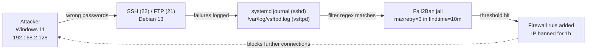

Each **jail** combines three things:

1. **A filter**: a regex that recognises a failed login in the logs
2. **A log source**: the file or journal to watch
3. **An action**: what to do when the threshold is hit, which here is a firewall ban

---

## Build steps

### 1. Update the system

```bash
sudo apt-get update && sudo apt upgrade -y
```

**Why:** you should always patch before you install new software. It gets you current security fixes and avoids dependency conflicts.

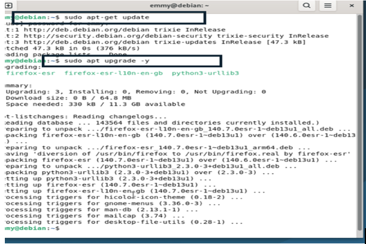

### 2. Install Fail2Ban and check the version

```bash
sudo apt install fail2ban -y
fail2ban-client --version     # Fail2Ban v1.1.0
```

**Why:** the version check proves the install worked. It also tells you which documentation applies, because config behaviour changes between releases.

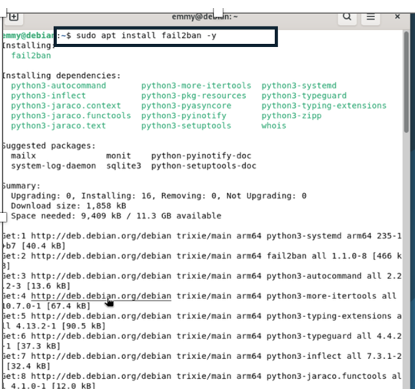
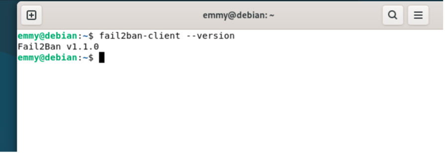

### 3. Review the main daemon config

```bash
sudo nano /etc/fail2ban/fail2ban.conf
```

I checked the daemon-level settings, such as `loglevel = INFO` and the log target, and left them at their defaults.

**Why:** `fail2ban.conf` controls how the Fail2Ban server itself behaves, not the jails. Knowing where it logs is essential when you need to troubleshoot why a ban did or did not happen.

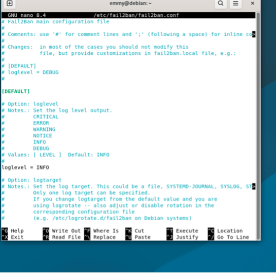

### 4. Start the service and confirm it is running

```bash
sudo systemctl start fail2ban
sudo systemctl enable fail2ban     # start on boot
sudo systemctl status fail2ban
```

**Why:** a security control that is not running protects nothing. `enabled` in the status output means it will survive a reboot.

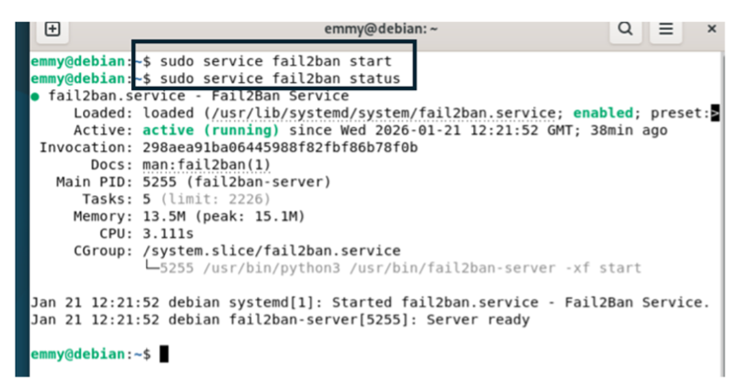

### 5. Create `jail.local` for local overrides

```bash
sudo cp /etc/fail2ban/jail.conf /etc/fail2ban/jail.local
sudo nano /etc/fail2ban/jail.local
```

**Why:** `jail.conf` belongs to the package and can be overwritten on upgrade. Settings in `jail.local` take priority and are never touched by `apt`, so custom policy survives updates.

Global defaults:

| Setting | Value | Meaning |
|---|---|---|
| `bantime` | `1h` | How long an offending IP stays blocked |
| `findtime` | `10m` | The window in which failures are counted |
| `maxretry` | `5` | Failures allowed inside `findtime` before a ban |

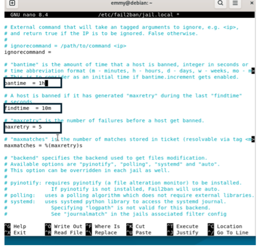

### 6. Enable and tighten the SSH jail

```ini
[sshd]
enabled  = true
maxretry = 3
```

**Why:** SSH is the most attacked service on any internet-facing Linux box. I lowered `maxretry` from 5 to 3 for SSH only. That is strict enough to stop guessing quickly, but still allows for a couple of typos.

On Debian 13 the `sshd` jail reads the **systemd journal** (`_SYSTEMD_UNIT=ssh.service`) rather than `/var/log/auth.log`, because Debian no longer writes that file by default.

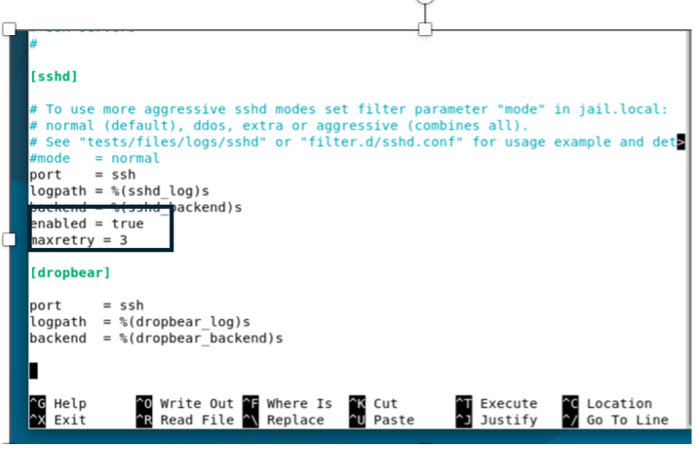

### 7. Restart and verify the jail is live

```bash
sudo systemctl restart fail2ban
sudo fail2ban-client status          # list active jails
sudo fail2ban-client status sshd     # details for one jail
```

**Why:** the config is only read on start or restart. Checking the status confirms that the jail loaded and that there were no syntax errors.

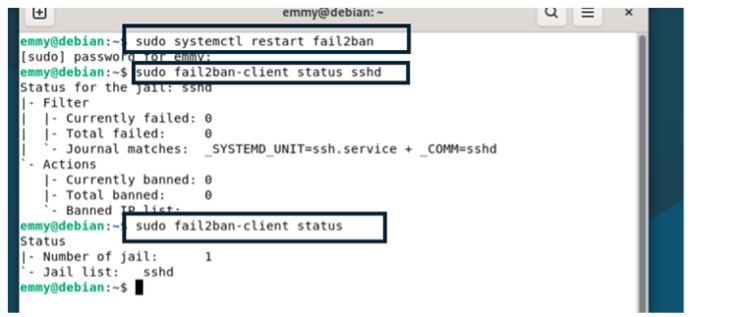

### 8. Check the firewall baseline

```bash
sudo iptables -L
```

The `INPUT` and `FORWARD` chains have a **default DROP** policy, managed by UFW.

**Why:** Fail2Ban is not a firewall replacement. The static firewall denies everything that is not explicitly allowed (least privilege). Fail2Ban adds a *dynamic* layer on top, temporarily banning IPs that abuse the services that have to stay open, such as SSH.

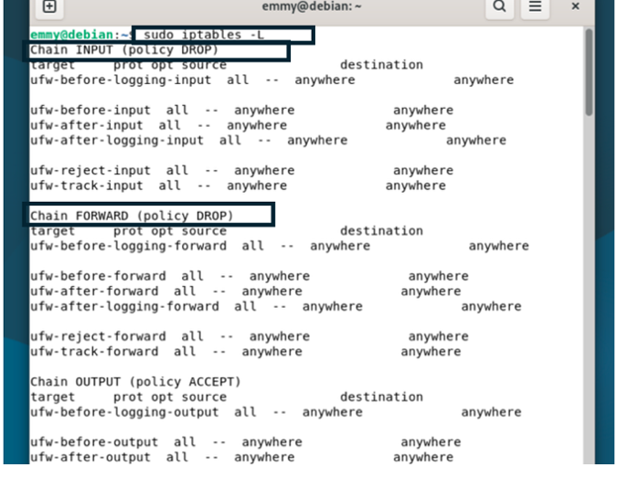

---

## Attack simulation 1: SSH brute force

From the Windows machine, I connected over SSH and entered the wrong password three times:

```cmd
ssh emmy@192.168.2.212
```

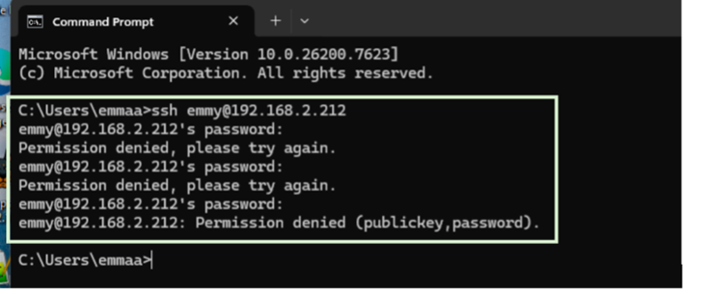

Then I checked the jail on the server:

```bash
sudo fail2ban-client status sshd
```

```text
Status for the jail: sshd
|- Filter
|  |- Currently failed: 0
|  |- Total failed:     3
|  `- Journal matches:  _SYSTEMD_UNIT=ssh.service + _COMM=sshd
`- Actions
   |- Currently banned: 1
   |- Total banned:     1
   `- Banned IP list:   192.168.2.128
```

**Result:** Fail2Ban detected all 3 failures, hit the `maxretry = 3` threshold and banned `192.168.2.128`.

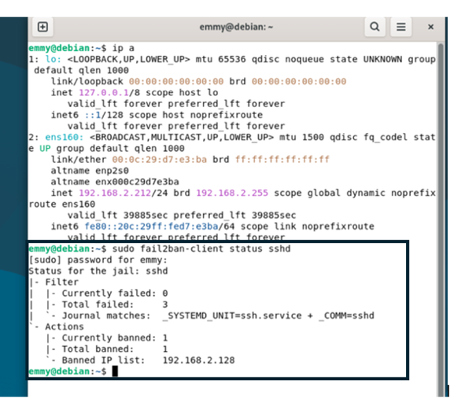

---

## Attack simulation 2: FTP brute force

To show that one Fail2Ban instance can protect several services, I added FTP.

### Install vsftpd

```bash
sudo apt install vsftpd -y
```

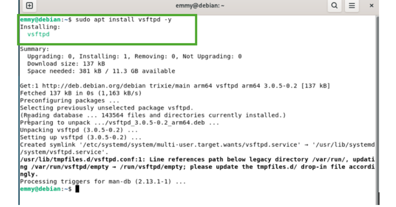

### Add the vsftpd jail

```ini
[vsftpd]
enabled  = true
port     = ftp,ftp-data,ftps,ftps-data
logpath  = /var/log/vsftpd.log
maxretry = 3
bantime  = 1h
```

**Why:** unlike SSH, vsftpd writes to its own log file, so the jail needs an explicit `logpath`. The `port` list makes sure the ban covers the FTP control channel and data channels, not only port 21.

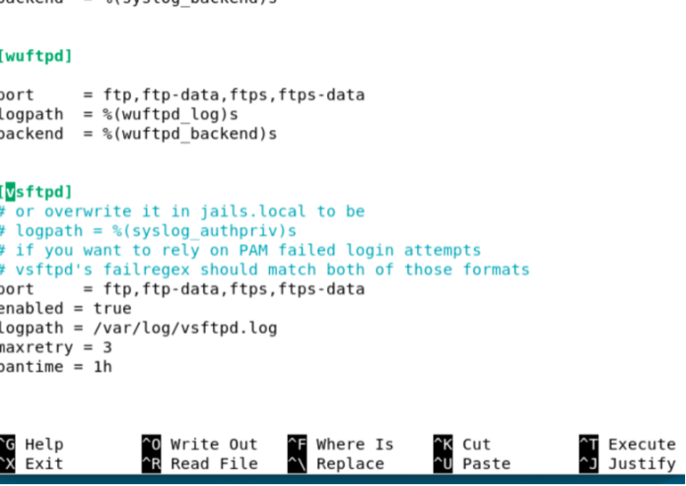

### Confirm both jails are active

```bash
sudo systemctl restart fail2ban
sudo fail2ban-client status
# Number of jail: 2
# Jail list: sshd, vsftpd
```

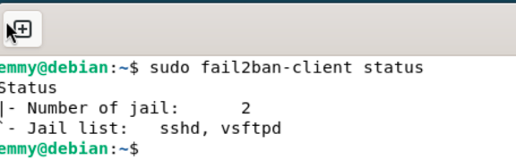

### Attack

From Windows, I made three failed FTP logins with made-up usernames (`admin`, `hack`). After the third failure, the server closed the connection.

```text
530 Login incorrect.
Connection closed by remote host.
```

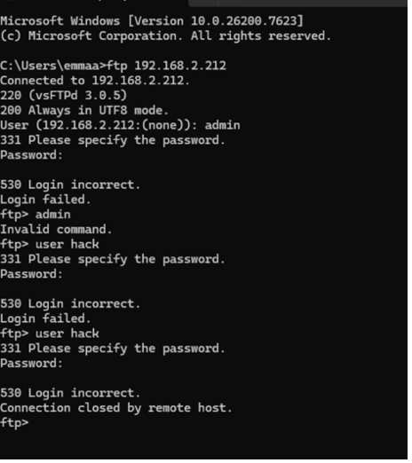

```bash
sudo fail2ban-client status vsftpd
```

```text
Status for the jail: vsftpd
|- Filter
|  |- Currently failed: 0
|  |- Total failed:     3
|  `- File list:        /var/log/vsftpd.log
`- Actions
   |- Currently banned: 1
   |- Total banned:     2
   `- Banned IP list:   192.168.2.128
```

**Result:** the same attacker IP was banned from FTP, detected from a completely different log source.

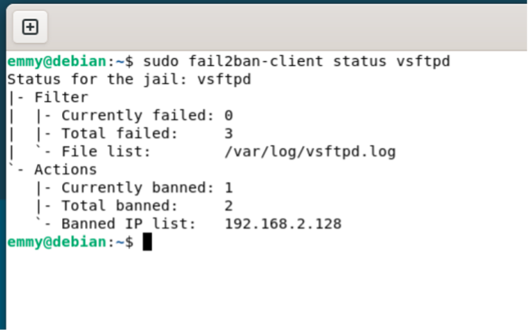

---

## Command cheat sheet

```bash
# Service
sudo systemctl status fail2ban
sudo systemctl restart fail2ban

# Jails
sudo fail2ban-client status                  # all jails
sudo fail2ban-client status sshd             # one jail

# Manual ban and unban (useful when you lock yourself out)
sudo fail2ban-client set sshd banip   203.0.113.10
sudo fail2ban-client set sshd unbanip 192.168.2.128

# Test a filter against a log before trusting it
sudo fail2ban-regex /var/log/vsftpd.log /etc/fail2ban/filter.d/vsftpd.conf

# Fail2Ban's own log
sudo tail -f /var/log/fail2ban.log
```

My final jail overrides are in [`config/jail.local`](config/jail.local).

---

## Limitations

- **Log-dependent:** if a service does not log a failure, or logs it in a format the filter does not match, Fail2Ban never sees the attack.
- **Reactive:** it acts only *after* failures happen. It does not predict or prevent the first attempts.
- **Host-only scope:** each server protects itself. Nothing is shared across a fleet unless you build that in.
- **Weak against distributed attacks:** a botnet that uses many IPs, each staying under `maxretry`, is never banned.
- **Lockout risk:** a legitimate user who mistypes a password 3 times is banned too. Trusted admin IPs can be exempted with `ignoreip`.
- **Blind to encrypted payloads:** it only sees what the service logs, not the content of encrypted traffic.

This is why Fail2Ban is one layer in a defence-in-depth approach, not a complete solution.

---

## What I learned and would do differently

- **Keep `jail.local` minimal.** I copied all of `jail.conf` into `jail.local`. It works, but the cleaner way is to put only the lines you change in `jail.local`, as in [`config/jail.local`](config/jail.local), so the policy can be read at a glance.
- **Check where logs actually go.** Debian 13 sends SSH logs to the systemd journal, not `/var/log/auth.log`. A jail pointed at a file that does not exist will fail to start. For services that log to a file, the file must exist before the jail starts.
- **Verify the ban at firewall level too**, not just in `fail2ban-client`: run `sudo nft list ruleset` or `sudo iptables -L -n` and look for the `f2b-` chains.
- **Next hardening steps:** key-only SSH (`PasswordAuthentication no`), `ignoreip` for the admin workstation, `bantime.increment = true` so repeat offenders get longer bans, and replacing plain FTP with SFTP.

---

## Skills demonstrated

- Linux package management and patching (`apt`)
- Service management with `systemd` (`systemctl`, `journalctl` log sources)
- Config file management and the override pattern (`.conf` vs `.local`)
- Firewall concepts: default-deny policy, UFW and iptables/nftables, dynamic blocking
- SSH and FTP service configuration
- Log analysis and regex-based detection
- Attack simulation and evidence-based validation
- Technical documentation

---

*Author: Emmanuel Aliu · MSc Cloud and Network Security, University of Greater Manchester*
